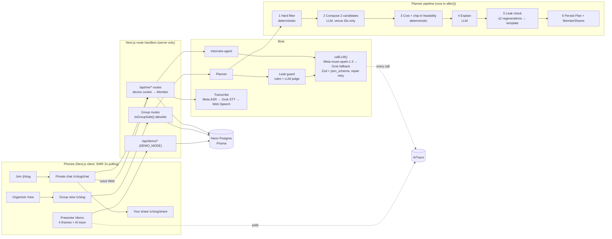

# Quiet Consensus: build plan

> Plans everyone can say yes to.

Status: **waiting for "go"**. No app code is written yet.

---

## 0. Repo layout decisions (made from defaults)

- The app lives at the **repo root** (`hackgt-2026/`).
- The handoff is currently in `quiet-consensus/`. At M0 I will move `quiet-consensus/design/` to `design/` and `quiet-consensus/CLAUDE_CODE_PROMPT.md` to `docs/BRIEF.md`. The root `README.md` (currently a copy of the design README) will be replaced by the real README, and the design README stays at `design/README.md`.
- **Schedule reset:** it is about 11:30 AM Sat now, not early morning, so every milestone below is re-timed. I also moved **voice after planner and money**. That way the core demo path (interview → plan → chip-in → share) is secure first. Voice is still a Must.

---

## 1. Architecture



Key runtime choices:
- **Planner runs in `after()`** (Next.js post-response work), so the "Plan now" call and the last interview answer return immediately. The planner writes `Circle.planningStage` as it goes, and the stepper polls that, so the stepper shows **real** stages.
- Planner route and interview route set `export const maxDuration = 60` for Vercel.
- **Simulate is client-driven.** The presenter page calls `POST /api/demo/simulate { memberId }` once per turn with 1.5–3s delays on the client. This avoids long-running serverless functions, and each call does exactly one persona turn plus one Hush turn.

---

## 2. File tree

```
.
├── PLAN.md  README.md  WRITEUP.md  DEMO_SCRIPT.md  DEVPOST.md  LICENSE (MIT)
├── .env.example
├── design/                         # reference screens (moved from quiet-consensus/)
├── docs/BRIEF.md
├── data/
│   ├── venues.json                 # ~20 Midtown / GT venues, verified:false
│   └── personas.json               # Omar, Maya, Priya, Jordan private limits
├── prisma/schema.prisma
├── app/
│   ├── layout.tsx  globals.css     # Geist, 430px centered column
│   ├── page.tsx                    # 1 Welcome
│   ├── new/page.tsx                # organizer chat-style setup
│   ├── j/[slug]/page.tsx           # 2 Join sheet
│   ├── c/[slug]/page.tsx           # 5 Planning stepper / 6 Plan card / vote
│   ├── c/[slug]/chat/page.tsx      # 3 Interview, 4 Voice, 7 Chip-in
│   ├── c/[slug]/share/page.tsx     # 8 Your share + mock pay sheet
│   ├── demo/page.tsx               # presenter view
│   └── api/
│       ├── circles/route.ts                    # POST create
│       ├── circles/[slug]/route.ts             # GET group-safe view
│       ├── circles/[slug]/join/route.ts        # POST join
│       ├── circles/[slug]/plan/route.ts        # POST run planner
│       ├── circles/[slug]/qr/route.ts          # GET QR SVG
│       ├── me/chat/route.ts                    # GET/POST private chat
│       ├── me/voice/route.ts                   # POST multipart → transcript
│       ├── me/share/route.ts  me/chipin/route.ts  me/vote/route.ts  me/pay/route.ts
│       └── demo/{seed,reset,simulate,trace}/route.ts
├── components/                     # section 7 of the brief, one file each
│   ├── HushMascot.tsx FloatingIconButton.tsx BotPill.tsx GroupPill.tsx
│   ├── HushBubble.tsx MemberBubble.tsx TypingDots.tsx OptionCard.tsx
│   ├── Composer.tsx VoiceNoteBubble.tsx ConfirmChips.tsx AvatarStack.tsx
│   ├── MemberStatusGrid.tsx PlanningStepper.tsx PlanCard.tsx ChipInCard.tsx
│   ├── ShareCard.tsx PrimaryPill.tsx Sheet.tsx ScrollFade.tsx QrCode.tsx
├── lib/
│   ├── db.ts                       # Prisma singleton
│   ├── identity.ts                 # cookie sign/verify, getMember(slug, req), demo ?as
│   ├── serialize.ts                # toGroupSafe() ← the ONLY group serializer
│   ├── ratelimit.ts                # per device token, in-memory token bucket
│   ├── wav.ts (client)             # 16 kHz mono PCM → WAV
│   ├── money/allocate.ts           # pure chip-in math
│   └── ai/
│       ├── client.ts               # callLLM + trace logging
│       ├── schemas.ts              # all Zod schemas
│       ├── interview.ts  planner.ts  filter.ts  guard.ts  transcribe.ts  persona.ts
│       └── prompts/{interview,compose,explain,judge,persona}.md
└── tests/
    ├── allocate.test.ts  serialize.test.ts  guard.test.ts  filter.test.ts
```

---

## 3. Prisma schema

```prisma
generator client { provider = "prisma-client-js" }
datasource db { provider = "postgresql"; url = env("DATABASE_URL") }

enum CircleStatus   { COLLECTING PLANNING PROPOSED CONFIRMED }
enum PlanningStage  { NONE READING FILTERING COMPOSING BALANCING CHECKING DONE FAILED }
enum Role           { ORGANIZER MEMBER }
enum InterviewStatus{ NOT_STARTED IN_PROGRESS DONE }
enum MsgRole        { HUSH MEMBER }
enum MsgKind        { TEXT OPTIONS VOICE CONFIRM CHIPIN FOLLOWUP }
enum VoteChoice     { IN DIFFERENT_TIME TWEAK }

model Circle {
  id            String   @id @default(cuid())
  slug          String   @unique            // 8-char nanoid
  title         String
  activity      String                      // "dinner", "hangout"...
  area          String
  windowStart   DateTime
  windowEnd     DateTime
  status        CircleStatus  @default(COLLECTING)
  planningStage PlanningStage @default(NONE)
  replanCount   Int      @default(0)
  organizerId   String?  @unique
  isDemo        Boolean  @default(false)
  createdAt     DateTime @default(now())
  members       Member[]
  plans         Plan[]
  traces        AiTrace[]
}

model Member {
  id              String   @id @default(cuid())
  circleId        String
  circle          Circle   @relation(fields: [circleId], references: [id], onDelete: Cascade)
  name            String
  avatarColor     String   // peach | blue | green | lilac
  tokenHash       String   @unique          // sha256 of device token
  role            Role     @default(MEMBER)
  interviewStatus InterviewStatus @default(NOT_STARTED)
  persona         String?  // demo only: key into personas.json
  paidAt          DateTime?
  createdAt       DateTime @default(now())
  messages        Message[]
  vault           Vault?
  shares          MemberShare[]
  votes           Vote[]
}

model Message {
  id         String   @id @default(cuid())
  memberId   String
  member     Member   @relation(fields: [memberId], references: [id], onDelete: Cascade)
  role       MsgRole
  kind       MsgKind  @default(TEXT)
  content    String
  options    Json?    // string[] rendered A–E
  chips      Json?    // confirm chips
  transcript String?
  createdAt  DateTime @default(now())
  @@index([memberId, createdAt])
}

model Vault {
  memberId         String  @id
  member           Member  @relation(fields: [memberId], references: [id], onDelete: Cascade)
  budgetCapCents   Int?
  dietary          String[]
  alcohol          String?  // fine | prefer_none | none
  stepFreeRequired Boolean?
  availableWindows Json?    // {day,start,end}[]
  noise            String?  // quiet | any
  vibe             String[]
  maxTravelMinutes Int?
  privateNote      String?
  updatedAt        DateTime @updatedAt
}

model Plan {
  id              String   @id @default(cuid())
  circleId        String
  circle          Circle   @relation(fields: [circleId], references: [id], onDelete: Cascade)
  version         Int
  title           String
  dateLabel       String            // "Sat, Oct 3 · Midtown Atlanta"
  stops           Json              // {time, venueId, name, note, items:{label,cents}[]}[]
  perPersonCents  Int
  whyItWorks      String[]
  leakCheckPassed Boolean
  status          String   @default("PROPOSED") // PROPOSED | SUPERSEDED | CONFIRMED
  createdAt       DateTime @default(now())
  shares          MemberShare[]
  chipIns         ChipIn[]
  votes           Vote[]
  @@unique([circleId, version])
}

model MemberShare {
  id          String @id @default(cuid())
  planId      String
  plan        Plan   @relation(fields: [planId], references: [id], onDelete: Cascade)
  memberId    String
  member      Member @relation(fields: [memberId], references: [id], onDelete: Cascade)
  baseCents   Int
  capCents    Int?   // snapshot for allocation
  shortfallCents Int @default(0)
  headroomCents  Int?  // null = unlimited
  coveredCents   Int @default(0)
  chipInCents    Int @default(0)
  refundCents    Int @default(0)
  finalCents     Int
  privateNote    String
  @@unique([planId, memberId])
}

model ChipIn {          // NEVER serialized by any route
  id           String @id @default(cuid())
  planId       String
  plan         Plan   @relation(fields: [planId], references: [id], onDelete: Cascade)
  fromMemberId String
  amountCents  Int
  createdAt    DateTime @default(now())
  @@unique([planId, fromMemberId])
}

model Vote {
  id       String @id @default(cuid())
  planId   String
  plan     Plan   @relation(fields: [planId], references: [id], onDelete: Cascade)
  memberId String
  member   Member @relation(fields: [memberId], references: [id], onDelete: Cascade)
  choice   VoteChoice
  @@unique([planId, memberId])
}

model AiTrace {
  id        String   @id @default(cuid())
  circleId  String?
  circle    Circle?  @relation(fields: [circleId], references: [id], onDelete: Cascade)
  task      String   // interview | compose | explain | judge | transcribe | persona | filter | allocate
  provider  String   // meta | xai | local | webspeech
  ms        Int
  ok        Boolean
  label     String   // human line for the trace panel: "23 → 9 venues after hard filter"
  meta      Json?    // counts only, never private text
  createdAt DateTime @default(now())
  @@index([circleId, createdAt])
}
```

The trace stores **counts and labels only**, never prompts or private content, so the presenter panel cannot leak anything.

---

## 4. Identity and privacy model

- **Device cookie, one per circle:** `qc_<slug>` = `<memberId>.<token>.<hmac>`, where the HMAC uses `COOKIE_SECRET`. httpOnly, SameSite=Lax, Secure in prod. The DB stores only `sha256(token)`.
- `getMember(slug)` verifies the HMAC and looks up by `tokenHash`. `/api/me/*` routes take `?c=<slug>` and only ever read or write the caller's own rows.
- **Demo impersonation:** when `DEMO_MODE=true`, pages accept `?as=<memberId>` and forward it as an `x-demo-as` header. The server honors it only if DEMO_MODE is on **and** the member belongs to an `isDemo` circle.
- **One serializer:** every group route returns `toGroupSafe(circle)`. It is an explicit allowlist with these fields:
  - circle: slug, title, area, dateLabel, status, planningStage
  - members: id, name, avatarColor, role, interviewStatus, hasVoted (a boolean, not the choice)
  - current plan: title, dateLabel, stops (time, name, neutral note), whyItWorks, perPersonCents, leakCheckPassed, voteCounts

  It never includes Vault, Message, MemberShare, ChipIn, or persona.
- **What the organizer sees:** the same group view as everyone else. Organizer rights are limited to "Plan now" and "Confirm".
- **Chip-in secrecy:** there are no routes that list ChipIns. A recipient sees only their own `coveredCents`. A contributor sees their own `chipInCents` plus the aggregate `poolCents / needCents`. The group view shows nothing about the pool.
- **Crisis content:** the interview can flag a message as `sensitive`. When it does, `constraintUpdates` are dropped, nothing goes to the vault, and Hush replies with care and points to 988.
- **Tests:** `serialize.test.ts` seeds budget caps, `privateNote`, and message text, then asserts that none of those strings (or cap numbers like "15") appear anywhere in `JSON.stringify(toGroupSafe(...))`.

---

## 5. API routes

| Method + path | Auth | Returns |
|---|---|---|
| `POST /api/circles` `{title, activity, area, windowStart, windowEnd, organizerName}` | none | `{slug}` + organizer cookie |
| `GET /api/circles/[slug]` | none | `toGroupSafe()` |
| `GET /api/circles/[slug]/qr` | none | SVG QR of `APP_URL/j/slug` |
| `POST /api/circles/[slug]/join` `{name}` | none | `{memberId}` + cookie (idempotent if cookie exists) |
| `POST /api/circles/[slug]/plan` | organizer, or internal auto-trigger | `202`; runs planner in `after()` |
| `POST /api/circles/[slug]/confirm` | organizer | confirms; replans at a lower ceiling if pool < need |
| `GET /api/me/chat?c=` | member | own messages + `interviewStatus` + chip-in card state |
| `POST /api/me/chat?c=` `{text? , optionIndex?, kind?}` | member | Hush's reply message (rate-limited) |
| `POST /api/me/voice?c=` multipart `audio` | member | `{transcript, provider}` |
| `GET /api/me/share?c=` | member | own share line items, coverage line, pool aggregate if contributor |
| `POST /api/me/chipin?c=` `{amountCents}` | member with headroom | updated pool aggregate |
| `POST /api/me/vote?c=` `{choice}` | member | `{ok}`; B or C posts a private FOLLOWUP message |
| `POST /api/me/pay?c=` | member | `{ok, demo:true}`, sets `paidAt` |
| `POST /api/demo/seed` | DEMO_MODE | `{slug, members:[{id,name,persona}]}` |
| `POST /api/demo/reset` | DEMO_MODE | deletes all `isDemo` circles and reseeds |
| `POST /api/demo/simulate` `{memberId}` | DEMO_MODE | one persona turn + one Hush turn |
| `GET /api/demo/trace?c=` | DEMO_MODE | AiTrace rows (labels + counts only) |

Errors are all `{error: string}` with no stack traces. If both AI providers fail, the chat returns Hush's fallback line: "I'm having trouble thinking right now. Try again in a moment."

---

## 6. AI: client, prompts, and schemas

### 6.1 `callLLM<T>({task, messages, schema, reasoningEffort, temperature, circleId, label})`
1. Meta (`muse-spark-1.3`), 20s `AbortController` timeout, `response_format: json_schema` from `zodToJsonSchema(schema)`, `strict: true`.
2. If the provider returns a 400 that mentions `response_format`/`json_schema`, retry that provider with `{type:'json_object'}` and cache that choice per provider.
3. If Zod validation fails, send one repair retry: append the bad output plus "Your JSON failed validation: <issues>. Return only corrected JSON."
4. On a timeout, 5xx, 429, or a second validation failure, fall back to Grok (`XAI_MODEL`) with the same steps.
5. Always write `AiTrace {task, provider, ms, ok, label, meta}`. Returns `{data, provider, ms}`.
6. At M2 I will make one `GET /v1/models` call on each provider to confirm model IDs. If a faster Grok model is listed, I'll suggest it.

### 6.2 Interview (`reasoningEffort: 'low'`, temp 0.6)

`prompts/interview.md` (essentials; full text written at M2):
> You are Hush, a warm, brief planning helper. You are privately chatting with {name} about {circle.title} ({activity}, {dateLabel}, {area}), organized by {organizer}. This chat is private: nothing they say is shown to the group or the organizer.
> Rules:
> - Ask one question at a time, in 1–2 short sentences. Never judge. Never ask *why* someone has a limit.
> - Your first message says "This chat is just between us."
> - Go through topics in order: budget → food → drinks → access (getting around) → timing → vibe → confirm. Skip a topic that is already answered in KNOWN. Adapt your follow-ups.
> - Always give 3–5 short quick replies. The last is open-ended ("I'd rather explain", "Something else").
> - When the user explains a reason, thank them briefly and promise "no one will know it came from you".
> - At `confirm`: summarize in their own words as chips ("Under $15", "Step-free places only"). Offer A "That's right" / B "Change something".
> - If they share a crisis or something serious beyond planning, reply with care, mention the 988 Suicide & Crisis Lifeline (call or text 988 in the US), set `sensitive: true`, and make no constraint updates.
> KNOWN: {vault as JSON}. Output JSON only, following the schema.

```ts
const InterviewTurn = z.object({
  reply: z.string().max(400),
  options: z.array(z.string().max(40)).max(5),
  topic: z.enum(['budget','food','drinks','access','timing','vibe','confirm','done']),
  constraintUpdates: z.object({
    budgetCapCents: z.number().int().nonnegative().nullable().optional(),
    dietary: z.array(z.string()).optional(),          // normalized: halal, kosher, vegetarian, vegan, gluten_free, nut_allergy...
    alcohol: z.enum(['fine','prefer_none','none']).nullable().optional(),
    stepFreeRequired: z.boolean().nullable().optional(),
    availableWindows: z.array(z.object({ day: z.string(), start: z.string(), end: z.string() })).optional(),
    noise: z.enum(['quiet','any']).nullable().optional(),
    vibe: z.array(z.string()).optional(),
    maxTravelMinutes: z.number().int().nullable().optional(),
    privateNote: z.string().max(200).nullable().optional(),
  }),
  confirmChips: z.array(z.string().max(40)).max(6).optional(),
  sensitive: z.boolean().default(false),
  done: z.boolean(),
});
```

- **Deterministic fast path:** if the member taps a budget option ("Under $15"), the server parses the dollar amount locally and sets `budgetCapCents` directly, so the key demo value never depends on the model. Time windows get the same treatment ("after 6" → 18:00–23:59).
- **Merge rules:** arrays are unioned, and null means "unset". `done:true` sets the member to DONE. When the last member finishes, the planner auto-runs.
- **Token budget:** send the last 12 messages plus the vault JSON, not the whole history.

### 6.3 Planner

**Step 1: hard filter (`lib/ai/filter.ts`, pure, tested).** A venue survives only if **all** of these hold:
- `dietary` coverage: for each required diet in the group, the venue supports it. For `halal`/`vegetarian` it checks the flag, and "food truck park" venues can list several.
- no member has `alcohol: none`, or `alcoholFocus !== 'bar'`
- no member needs step-free access, or `stepFreeEntry && (accessibleRestroom || kind is outdoor with a public accessible restroom nearby flag)`
- `hours` overlap the intersection of everyone's windows on the plan date (for the demo, Saturday 18:00–23:00)
- the venue is in the circle's area cluster (demo: all Midtown/GT venues are within 20 min)

Trace label: `"20 → 9 venues after hard filter"`.

**Step 2: compose (`medium`, temp 0.7).** The input is anonymized with no names:
```json
{ "activity":"dinner", "date":"Sat Oct 3", "window":{"start":"18:00","end":"23:00"},
  "lowestBudgetCents":1500, "typicalBudgetCents":3250,
  "needs":["halal options","alcohol-free friendly","step-free","quiet-ish"],
  "vibe":["chill","outdoors"],
  "venues":[{ "id":"v07","name":"…","kind":"food_truck_park","costPerPersonCents":1600,"noise":"any", … }] }
```
```ts
const Candidate = z.object({
  title: z.string(),
  stops: z.array(z.object({
    venueId: z.string(), time: z.string(),                // "6:30 PM"
    items: z.array(z.object({ label: z.string(), cents: z.number().int() })).min(1),
  })).min(2).max(3),
  vibeFit: z.number().min(0).max(1),
});
const ComposeOut = z.object({ candidates: z.array(Candidate).length(2) });
```
The server rejects any `venueId` that is not in the filtered list. When that happens it sends one repair retry naming the bad IDs. Venue names and facts always come from `venues.json`, never from the model.

**Step 3: cost (deterministic).** `perPerson = Σ item cents`, and `allocate()` runs on each candidate (see 7). A candidate is feasible if `D ≤ Σ_j min(h_j, 1000)`. Scoring: `score = vibeFit − 0.02·(D/100)`. A zero-shortfall candidate wins only if its `vibeFit` is within 0.1 of the best. If none are feasible, recompose once with `maxPerPersonCents = lowestCap + available pool`. Trace label: `"Cost balanced: shortfall $10"`.

**Step 4: explain (`medium`, temp 0.5).** The input is the chosen plan plus the anonymized needs.
```ts
const ExplainOut = z.object({
  title: z.string().max(60),
  stopNotes: z.array(z.string().max(80)),          // neutral amenities only
  whyItWorks: z.array(z.string().max(80)).max(3),
  memberNotes: z.record(z.string(), z.string().max(80)), // memberId -> private "Fits what you told Hush..."
});
```
`memberNotes` are generated in a **separate call per member**, using only that member's vault. They are private and never go through the group serializer.

**Step 5: leak check (see 6.4).** Up to 2 regenerations with the judge's feedback, then a safe template:
title = `"{Activity} night"` and whyItWorks = `["Picked to fit everyone's budget, food, and getting around", "Everything is within a short trip", "Fits the time everyone has free"]`. The safe template also has to pass the rule layer, and a test checks that.

**Step 6: persist.** Create the Plan (version n), the MemberShares, and set status PROPOSED and stage DONE. Planner stages map to the design's stepper rows:

| Stage | Stepper row |
|---|---|
| READING | Read 4 private chats |
| FILTERING/COMPOSING | Found 9 places that fit everyone |
| BALANCING | Balancing everyone's costs |
| CHECKING | Checking nothing private shows |

### 6.4 Leak guard (`lib/ai/guard.ts`)

**Rule layer (pure, tested).** It builds a per-circle context `{names, capNumbers, privatePhrases}` and splits text into sentences. A sentence fails if any of these is true:
1. It contains a member name **and** any sensitive term.
2. It contains a sensitive term inside a causal frame (`since|because|as|so that|for (someone|those|anyone) who|due to`). For example, "Since Priya doesn't drink, we skipped bars" fails.
3. It contains a cap number (`$15`, `15 dollars`, `fifteen`) that is not the plan's own public per-person figure or a line-item price.
4. It contains a 4+ word n-gram from any `privateNote`.
5. It uses personal-need phrasing about the group ("someone can't afford", "one of you", "a friend who").

The sensitive lexicon covers money limits (afford, broke, tight, cheap, budget cap), alcohol (drink, sober, alcohol, bar-free), health and disability (wheelchair, disab, mobility, allergy, injury), religion (halal, kosher, religio, muslim, fast), and diet reasons.

Neutral amenity phrasing is allowed when it is **not** framed as a reason or attached to a person, for example "Paved, step-free paths" or "Halal, veggie and dessert trucks". "Budget" is allowed only in the generic "everyone's budget".

**LLM judge (`medium`, temp 0).** The input is each member's private facts (as `Member A/B/C` plus real names for inference checking) and the candidate group text.
```ts
const JudgeOut = z.object({ pass: z.boolean(), leaks: z.array(z.object({ text: z.string(), reason: z.string() })) });
```
Prompt: "Could any group member infer a specific person's private constraint from this text? Neutral venue amenities are fine. Stating a need as a reason, or narrowing it to one person, is a leak."

A plan passes only if **both** layers pass. `leakCheckPassed` controls the "Checked: nothing anyone told Hush shows here" line. Trace label: `"Leak check: pass"` (or `"Leak check: 1 fix, then pass"`).

**Other group-facing strings.** Vote follow-ups are private, so they are not group-facing. Group status messages are fixed templates, and a unit test runs them through the rule layer.

Tests:
- `"Since Priya doesn't drink, we skipped bars"` → fail
- `"Picked to fit everyone's budget, food, and getting around"` → pass
- `"Maya's budget is $15"` → fail
- `"Paved, step-free paths"` → pass
- `"We kept it cheap for someone who's tight on money"` → fail

### 6.5 Voice
- **Client:** `getUserMedia` → `AudioContext` → an AudioWorklet downsamples to 16 kHz mono Int16 → `lib/wav.ts` encodes a WAV Blob, capped at 60s. I'm hand-rolling this (≈60 lines) instead of pulling in `extendable-media-recorder`: it's fewer dependencies and gives the same result on iOS Safari. The mic button shows its active state and a timer.
- **Server `transcribe()`:**
  1. Meta `POST /v1/asr/transcribe` (multipart `request` JSON + `audio`)
  2. on failure, Grok `POST /v1/stt` (`model`, `file`, `language=en`)
  3. on failure, return `{error:'stt_unavailable'}`, and the client falls back to `webkitSpeechRecognition` if it is available.
- The transcript posts to the chat as `kind: VOICE` with `transcript`, then runs through the same interview turn. `VoiceNoteBubble` plays the local blob URL and shows the transcript.

### 6.6 Persona simulator (`prompts/persona.md`)
"You are {name}, texting a private planning bot. Your private facts: {persona}. Answer the bot's last message in 1 short casual sentence, or tap an option by returning its letter. Stay consistent with your facts. Never reveal facts you haven't been asked about." Output: `{text?: string, optionIndex?: number}`. Maya's first budget answer is scripted to tap "Under $15" and then type the design line, so the video is deterministic.

---

## 7. Chip-in math (`lib/money/allocate.ts`, all in integer cents)

```
input:  members[{id, baseCents s_i, capCents c_i|null}], contributions{id → cents}
d_i  = max(0, s_i − c_i)               (0 if c_i null)
D    = Σ d_i
h_j  = c_j null ? ∞ : max(0, c_j − s_j)
helpers = {j : h_j > 0 and d_j = 0}
suggest_j = min(h_j, 1000, ceil5( D / |helpers| ))     // ceil to nearest $5
accepted: each contribution is clamped to min(amount, h_j, D − poolSoFar), in createdAt order;
          the clamped excess is refund_j (and is never charged)
P    = Σ accepted
cover_i = floor(P · d_i / D); the leftover cents go by largest remainder, so Σ cover = P exactly; cover_i ≤ d_i
final_i = s_i − cover_i + chipIn_i
cardOpen = P < D
```

- Contributions are validated server-side against the same clamp, so the DB never holds more than D.
- On confirm, if `P < D`, replan with `maxPerPersonCents = lowestCap + floor(P / shortfallMembers)`.
- **Tests:**
  1. Base $25, caps 40/15/30/35: `D=1000`, helpers = Omar, Priya, Jordan, suggest $5 each. With Omar 500 and Priya 500, finals are Maya 1500, Omar 3000, Priya 3000, Jordan 2500, and Σ = 10000.
  2. No caps: D=0, no helpers, finals = base.
  3. Zero contributions: finals = base, `cardOpen` true.
  4. Over-contribution (Omar 1000 + Priya 500 against D=1000): Priya's 500 is refunded, P=1000, Σ final = Σ base.
  5. Two short members split proportionally, with exact-cent rounding.
  6. Invariant (property-style loop): Σ final = Σ base whenever P ≤ D.

---

## 8. Demo data

- **`personas.json`:**

  | Persona | Private limits |
  |---|---|
  | Omar (organizer) | halal, cap $40, fine with anything else, "chill" |
  | Maya | cap $15, has skipped dinners, "outdoors is nice" |
  | Priya | alcohol `none`, cap $30 |
  | Jordan | stepFree, free 18:00+, cap $35, voice-driven |

- **`venues.json`:** about 20 Midtown/GT places (parks, food truck spots, casual halal and veggie spots, dessert, a couple of bars and loud places so the filter visibly removes them). Every entry has `verified:false` and `sourceUrl`.
  - The UI shows a small "Demo venue" tag while `verified` is false.
  - Before the demo, confirm these by phone or website: **stepFreeEntry, accessibleRestroom, halal, hours on a Saturday evening, alcoholFocus, and typical cost**.
  - I will not state facts I can't source. Uncertain attributes default to the conservative value (for example `stepFreeEntry:false`).
- **Seed date:** the next Saturday, **Sat, Oct 3**, 6–11 PM, Midtown Atlanta.

---

## 9. Milestones (re-timed, ET)

| By | Milestone | Done means |
|---|---|---|
| Sat 12:30 PM | **M0 scaffold** | Next.js + TS + Tailwind tokens + Geist, Prisma + Neon migrated, `.env.example`, Vitest, MIT license, repo moved into shape, hello page deployed on Vercel |
| Sat 2:30 PM | **M1 circles** | `/new` (chat-style, form fallback), create → link + QR, `/j/[slug]` join sheet + cookie, `/c/[slug]` status grid with 2s polling, shell components, `toGroupSafe` + test |
| Sat 5:00 PM | **M2 interview** | `callLLM` with fallback + trace, interview agent + prompt, vault merge + fast paths, chat UI (bubbles, OptionCard, Composer, typing dots, confirm chips) |
| Sat 8:00 PM | **M3 planner** | venues.json, filter + tests, compose/explain/judge, guard + tests, stepper on real stages, PlanCard, votes + one replan |
| Sat 9:30 PM | **M4 money** | allocate + tests, ChipInCard, share screen, mock pay sheet, confirm flow |
| Sat 11:00 PM | **M5 voice** | WAV worklet, Meta ASR → Grok → Web Speech, VoiceNoteBubble, tested on iPhone + Android |
| Sun 1:00 AM | **M6 demo mode** | seed/reset/simulate, `/demo` 4 iframes + group view + trace panel, "Run the whole story" |
| Sun 2:30 AM | **M7 polish** | real-phone pass, motion, empty/error states, README, WRITEUP, DEMO_SCRIPT, DEVPOST |
| Sun 4:30 AM | **Video** | 2:30 video recorded (presenter view + 1 real phone) and uploaded |
| Sun 6:00 AM | **Submit** | Devpost with public repo, video, write-up |

After each milestone I will run `npm run build` and `npm test`, commit, and send a 3-line status.

**Cut order if we're behind:** vote replanning → voice fallback chain (Meta only) → simulate (drive 4 phones by hand) → organizer chat flow (plain form).

**Parallel work for teammate #2 (no code conflicts):**
- Verify venue attributes (section 8).
- Draft WRITEUP and DEVPOST prose.
- Collect real phones for testing.
- Plan the video shot list.

---

## 10. Risks and fallbacks

| Risk | Fallback |
|---|---|
| Meta API rejects `json_schema` or the model ID differs | auto-switch to `json_object` + Zod; confirm with `/v1/models` at M2; Grok fallback |
| Both LLMs are slow or down during recording | deterministic fast paths for budget/time; "Run the whole story" can replay a cached plan for the demo circle (it's a normal DB row, clearly produced earlier by the real pipeline) |
| LLM invents venues | ID allowlist + repair retry; names always come from JSON |
| Leak judge is flaky | rules layer is deterministic; 2 regenerations, then the safe template |
| iOS Safari mic / AudioWorklet quirks | ScriptProcessor fallback path; Web Speech; typed input always works |
| Vercel function timeouts in planner | `after()` + `maxDuration=60`; stages persisted, so a stuck plan shows FAILED + "Try again" |
| Cross-origin cookie issues in `/demo` iframes | same-origin iframes + `?as=` impersonation, no cookies needed |
| Neon cold starts | Prisma singleton; warm by hitting `/api/circles/demo` before recording |
| Venue facts unverified | "Demo venue" tag; conservative defaults |
| Polling load | only 4–5 clients; `revalidateOnFocus` off, and polling stops once the plan is confirmed |

---

## 11. Demo script (2:30)

| Time | Beat | On screen |
|---|---|---|
| 0:00–0:20 | "Two in three Americans have skipped plans because of cost, and most never said why." Introduce Maya, who keeps saying "I'm busy". | Welcome screen, Maya's phone |
| 0:20–0:45 | Omar starts "Saturday night" and 4 phones scan the QR code. | `/new` → QR → presenter view fills with 4 joins |
| 0:45–1:30 | Private chats run side by side. Maya taps **A · Under $15** and types her line. Jordan sends a voice note ("step-free… free after six") that turns into chips. Priya's chat gets filled by the simulator. | Presenter view, trace panel ticking |
| 1:30–2:05 | "Hush is planning" stepper and the trace: `4 private chats read → 20 → 9 venues → 2 candidates → shortfall $10 → Leak check: pass`. Plan card reveal. Point at "Why this works" and the checked line: "No one had to say it." | Group view + trace |
| 2:05–2:30 | Priya taps **Chip in $5** (Omar already has), so the pool reads $10 of $10. Maya's share shows **$15**. Everyone taps **A · I'm in**. Close: "Quiet Consensus. Plans everyone can say yes to." | Priya → Maya share → group |

---

## 12. Libraries (the README keeps the final list)

next, react, react-dom, typescript, tailwindcss (v3.4, `tailwind.config.ts` per brief), postcss, autoprefixer, framer-motion, @prisma/client, prisma, zod, zod-to-json-schema, openai, swr, qrcode, nanoid, vitest, @types/*.

---

## 13. Things you'll need to do by hand

1. Create a **Neon** database and paste its `DATABASE_URL` into `.env`.
2. Fill in `MODEL_API_KEY` (Meta) and `XAI_API_KEY` (Grok), and generate `COOKIE_SECRET` (I'll give you the command).
3. **Vercel:** run `vercel link` (or import the GitHub repo) and set the same env vars there.
4. **GitHub:** confirm it's OK to create a **public** repo named `hackgt-2026` (or `quiet-consensus`?) under your account with `gh repo create`. I won't push until you say so.
5. Verify venue attributes (section 8).

**No blocking questions.** Reply **"go"** to start M0. Tell me before then if you want a different repo name or the original milestone order (voice as M3).
