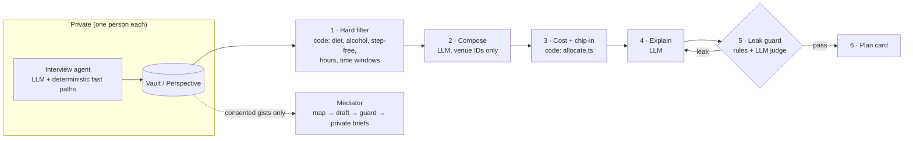

# Quiet Consensus

**Plans everyone can say yes to.**

Quiet Consensus is a web app where an AI planner named **Hush** privately asks each friend what they can't say in the group chat, such as budget, food, drinks, getting around, and timing. Hush then proposes one plan everyone can accept and explains it without revealing anyone's reasons. It also quietly balances the cost with an anonymous chip-in.

The same idea works for harder conversations. In **mediation mode**, Hush hears each person's side of a disagreement privately. It then proposes a fair way forward without quoting anyone or revealing what they kept private.

Built at **HackGT 13** for the Social Good track and the Meta challenge, "Bringing People Closer Together with AI".

---

## The problem

Group chats plan for the loudest person. People with a quiet limit (money above all, but also a religious diet, sobriety, or a disability) just say "I'm busy" and slowly drop out.

- 67% of Americans declined social events in the past two years primarily because of cost, and 56% never told loved ones that money was the reason ([CFP Board, Jan 2026, n=1,138](https://www.cfp.net/news/2026/03/financial-fomo-quietly-straining-american-relationships)).
- 69% of Americans have declined a social outing because it was too expensive, and 36% have had a friendship end over money ([LendingTree, July 2025, n=2,000](https://www.lendingtree.com/credit-cards/study/friends-money-report/)).
- Loneliness affects 1 in 6 people worldwide and is linked to more than 871,000 deaths a year ([WHO, June 2025](https://who.int/news/item/30-06-2025-social-connection-linked-to-improved-heath-and-reduced-risk-of-early-death)).
- 12% of Americans reported no close friends in 2021, up from 3% in 1990 ([Survey Center on American Life](https://www.americansurveycenter.org/research/the-state-of-american-friendship-change-challenges-and-loss/)).

Quiet Consensus lets people stay in without explaining themselves.

## How it works

### Plan a hangout

1. **Start a plan.** The organizer chats with Hush about what, when, and where, then shares a link or QR code. There are no accounts.
2. **Private interviews.** Each friend has a short, private chat with Hush. Every question offers lettered quick replies (A–E) as well as free text, and Hush never asks *why*. At the end, Hush shows "Here's what I'll plan around" in their own words for them to confirm.
3. **The group sees only progress.** It shows who has finished, never what anyone said.
4. **Hush plans.** A hybrid pipeline filters real venue data, composes candidate plans, balances cost, writes a group-safe explanation, and runs a leak check (see [AI pipeline](#ai-pipeline)).
5. **Quiet chip-in.** Friends with room in their budget privately see "Want to quietly help?" The pool covers anyone's shortfall. Nobody sees who gave or who was helped.
6. **Your share.** Each person sees only their own share and line items, and can pay through a mock payment sheet ("Demo payment. No real money moves.").
7. **Vote.** The choices are A "I'm in", B "Different time", or C "Tweak something". B and C get a private follow-up from Hush, and the organizer can ask for one replan.

### Work through a disagreement

1. The organizer names the topic neutrally, for example "The apartment".
2. Hush interviews each person privately in this order: what happened, how it affected them, what they need, what they hope for, what they'd offer, and what's off-limits.
3. **Consent.** Hush shows the short, nameless gist it would bring to the group. The person chooses **Yes, use this**, **Change it**, or **Keep all of this private**. Only approved gists reach the drafting step.
4. Hush drafts **a way forward**. It covers what everyone shares, what matters to the group, 3–5 concrete agreements, and how to talk about it. Each person also gets a **private brief**: where their needs show up, an opener in their own voice, and something they could offer.
5. **Safety.** If anyone mentions danger, abuse, or self-harm, Hush replies privately with resources (988, and the National Domestic Violence Hotline at 1-800-799-7233). That person's content never reaches the group, and the mediation pauses.

### Remember me (opt-in)

After confirming, Hush offers: "Want me to remember this for next time? Only this phone can use it."

- On the next plan, that phone opens with "Welcome back! Last time you told me: … Still right?", and one tap finishes the interview.
- Preferences are tied to the **device** with an httpOnly cookie, never to a name, so typing someone's name on another phone reveals nothing.
- **Settings → Forget this device** deletes them.

## AI pipeline



- **Interview agent** (`lib/ai/interview.ts`). It extracts structured constraints every turn, validated with Zod. Key values like "Under $15" or "after six" are parsed deterministically, so the most important numbers never depend on a model. A pacing guard stops it from looping on a topic.
- **Hard filter** (`lib/ai/filter.ts`). Pure code: in the demo group, 23 venues become 9. Names never reach the composer; it sees only an anonymous summary of the group's needs.
- **Compose.** The model may use only venue IDs from the filtered list. Prices and facts come from `data/venues.json`, never from the model.
- **Chip-in math** (`lib/money/allocate.ts`). Pure integer-cent math with tests: shortfall, headroom, suggestions capped at $10, and proportional cover with exact rounding. Refunds make sure the pool never collects more than it needs.
- **Leak guard** (`lib/ai/guard.ts`). Two layers, and both must pass:
  - *Rules* reject names next to a need, needs stated as reasons ("since…", "for someone who…"), private budget numbers, and repeated private phrases. "Why this works" lines may not name any specific need at all.
  - *LLM judge* answers: "Could any group member infer a specific person's private constraint?"
  - The draft is regenerated up to twice with the judge's feedback, then falls back to a safe template. "Checked: nothing anyone told Hush shows here" appears only when both layers pass.
- **Provider chain** (`lib/ai/client.ts`). There is one client for three OpenAI-compatible providers, tried in order:
  1. **Meta Model API** (`muse-spark-1.3`, primary)
  2. **Grok**
  3. **TypeSafe Jev** via OpenRouter

  Each call uses a JSON schema (also stated in the prompt), Zod validation, one repair retry, and backoff retries for transient errors. Every call is logged to an `AiTrace` row, which stores labels and counts only, never private text.

## Privacy model

- **Private by construction.** Every group route serializes through one allowlist function, `toGroupSafe()` (`lib/serialize.ts`). A test loads a circle with budgets, private notes, and private messages, then asserts that none of it appears in the output.
- **No accounts.** Each circle sets a signed, httpOnly device cookie, and the database stores only a hash of the token.
- **The organizer sees what everyone sees:** who has finished, and the plan.
- **The chip-in is anonymous.** No route lists contributions. A recipient sees only their own coverage line, and helpers see the pool as a total.
- **Mediation shares only consented, nameless gists.** Stories, feelings, and off-limits items stay in the vault. The guard uses them only to *block* leaks.
- **Keys stay server-side.** AI routes are rate-limited per device. Payments are mock only.

## Tech stack

Next.js 16 (App Router), TypeScript, Tailwind CSS, Framer Motion, Prisma with Postgres (Neon), SWR polling (2 seconds), and Zod. The UI follows the 8 phone screens in [`design/`](design/), and supports light and dark themes.

## Getting started

Requirements: Node 20+ and a Postgres database (a free Neon database works).

```bash
npm install
cp .env.example .env    # then fill in the values below
npx prisma db push      # create the tables
npm run dev -- -H 0.0.0.0   # -H lets phones on the same Wi-Fi open http://<your-LAN-IP>:3000
```

| Variable | What it's for |
|---|---|
| `DATABASE_URL` | Postgres connection string (pooled) |
| `DIRECT_URL` | Same database without the pooler, used by `prisma db push` |
| `COOKIE_SECRET` | Signs device cookies. Generate with `openssl rand -hex 32` |
| `APP_URL` | Base URL used for invite links |
| `DEMO_MODE` | `true` enables the demo routes and presenter impersonation |
| `MODEL_API_KEY`, `META_*` | Meta Model API (primary). `META_REASONING=minimal` is recommended |
| `XAI_API_KEY`, `XAI_*` | Grok (fallback) |
| `OPENROUTER_API_KEY`, `OPENROUTER_*` | TypeSafe Jev via OpenRouter (fallback) |
| `LLM_PROVIDERS` | Provider order, for example `meta,xai,openrouter`. Providers without a key are skipped |

You need at least one AI key.

### Tests

```bash
npm test            # unit tests: chip-in math, privacy serializer, leak guard, filter, parsing
npm run test:live   # live smoke tests against the configured AI providers
```

## Running the demo

With `DEMO_MODE=true`:

```bash
# Seed the story: "hangout" (Omar, Maya, Priya, Jordan) or "mediation" ("The apartment")
curl -X POST localhost:3000/api/demo/seed -H 'Content-Type: application/json' -d '{"story":"hangout"}'
# → { slug, members: [{ id, name }] }
```

- **Open any persona's phone** at `http://localhost:3000/c/<slug>/chat?as=<memberId>`. The group view is at `/c/<slug>`.
- **Let a persona answer on its own.** `POST /api/demo/simulate {"memberId": "..."}` plays one turn: an LLM answers as the persona, using `data/personas.json`.
- **See the pipeline.** `GET /api/demo/trace?c=<slug>` lists each step with provider, latency, and counts, for example "23 → 9 venues after hard filter", "Cost balanced: shortfall $10", and "Leak check: pass".
- **Reset.** `POST /api/demo/reset` deletes all demo circles.

In the hangout story, Omar and Priya are returning users with saved preferences. Maya taps "Under $15". The plan comes to $25 a head, and a quiet $10 pool (Omar $5, Priya $5) brings Maya's share to exactly $15.

**Demo venues** in `data/venues.json` are clearly labelled placeholders (`verified: false`, and "Demo venue" in the UI), not real businesses. Before using real places, confirm step-free entry, accessible restrooms, halal options, Saturday hours, and prices.

## Status

| Area | State |
|---|---|
| Hangout flow: create, join, interview, plan, chip-in, share, vote, replan | Working; end-to-end tested with four personas |
| Mediation flow: interview, consent, safety, draft, briefs, vote, redraft | Working; end-to-end tested |
| Remember me (opt-in, per device) | Working; end-to-end tested |
| Voice replies (mic → transcript) | Not built yet |
| Presenter view (`/demo`: four phones, AI trace panel) | Not built yet (the demo API routes exist) |

## Project layout

```
app/                 pages (/, /new, /j/[slug], /c/[slug], /c/[slug]/chat, /c/[slug]/share) and API routes
components/          UI components (chat bubbles, option cards, plan card, chip-in card, …)
lib/ai/              LLM client, interview, planner, mediator, filter, guard, prompts, schemas
lib/money/           chip-in allocation
lib/serialize.ts     toGroupSafe(), the only group serializer
data/                demo venues and personas
prisma/schema.prisma data model
design/              reference screens from the design canvas
tests/               Vitest unit tests (tests/live: live AI smoke tests)
```

## Libraries used

All project code was written during HackGT 13. Third-party libraries:

| Library | Use |
|---|---|
| [next](https://nextjs.org), [react](https://react.dev), [react-dom](https://react.dev) | App framework and UI |
| [typescript](https://www.typescriptlang.org) | Types |
| [tailwindcss](https://tailwindcss.com), [postcss](https://postcss.org), [autoprefixer](https://github.com/postcss/autoprefixer) | Styling |
| [framer-motion](https://www.framer.com/motion/) | Animation |
| [prisma](https://www.prisma.io), [@prisma/client](https://www.prisma.io) | Database ORM (Postgres on Neon) |
| [zod](https://zod.dev) | Validation of all AI output and user input |
| [openai](https://github.com/openai/openai-node) | OpenAI-compatible client for Meta, Grok, and OpenRouter |
| [swr](https://swr.vercel.app) | Polling for live updates |
| [qrcode](https://github.com/soldair/node-qrcode) | Invite QR codes |
| [nanoid](https://github.com/ai/nanoid) | Short, readable invite codes |
| [vitest](https://vitest.dev) | Tests |

Fonts: [Geist](https://vercel.com/font) via `next/font`. AI models: Meta Model API (`muse-spark-1.3`), with Grok and TypeSafe Jev (OpenRouter) as fallbacks.

## License

[MIT](LICENSE)
